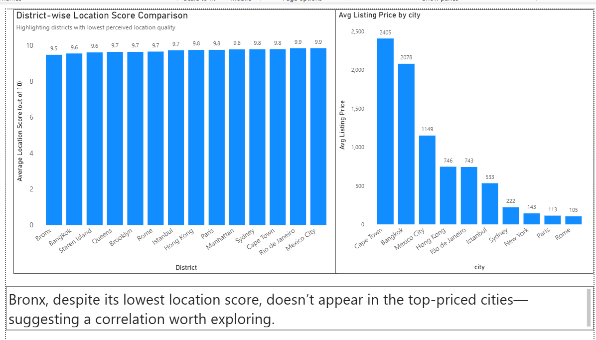
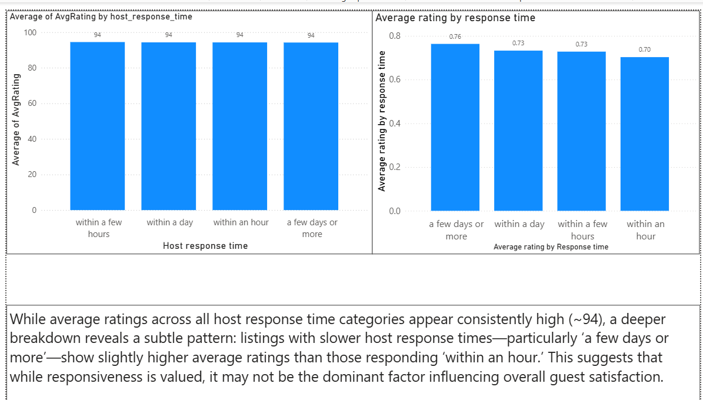
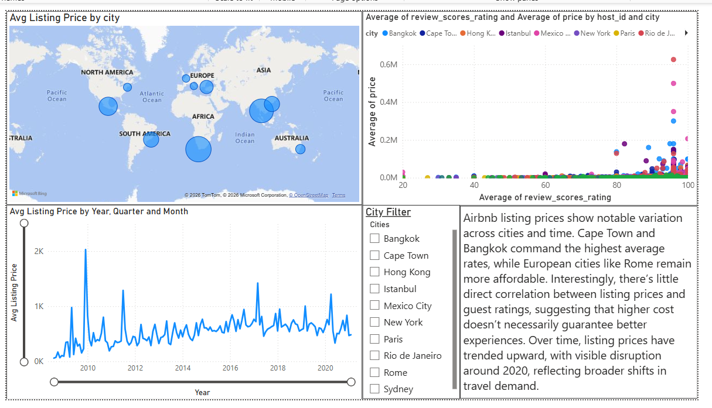
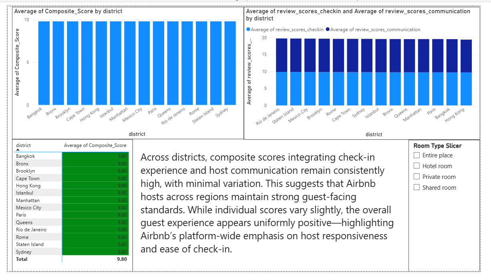
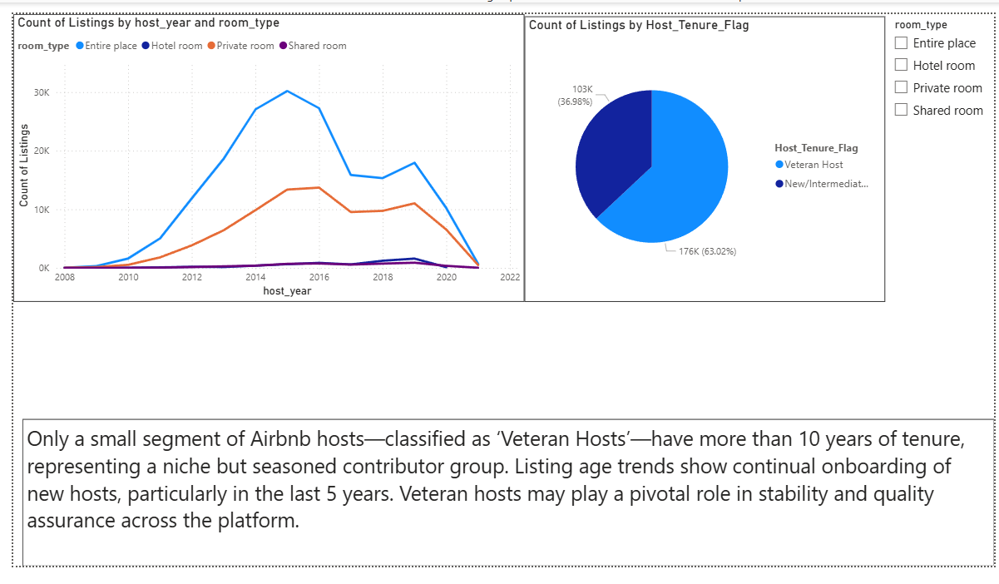
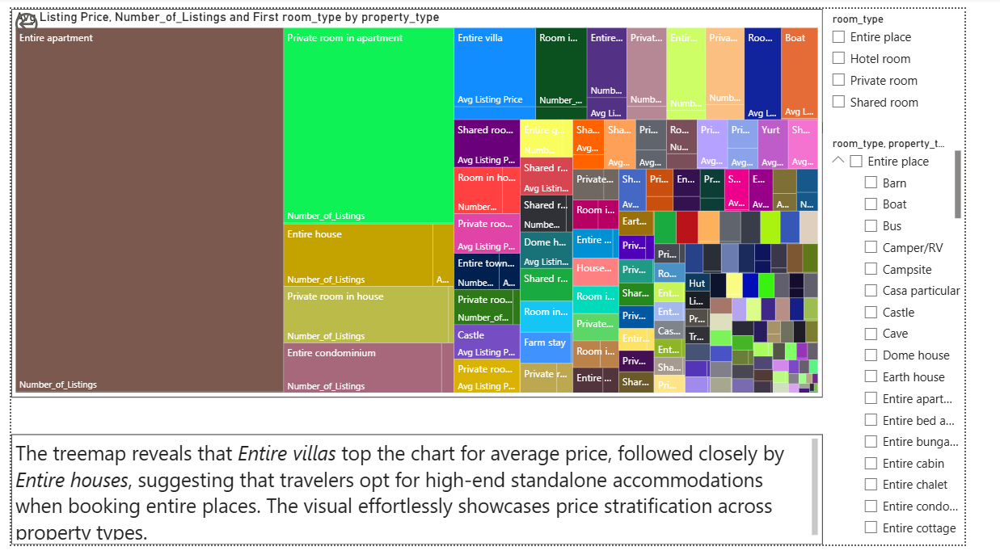
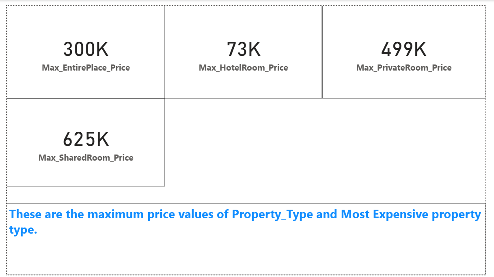
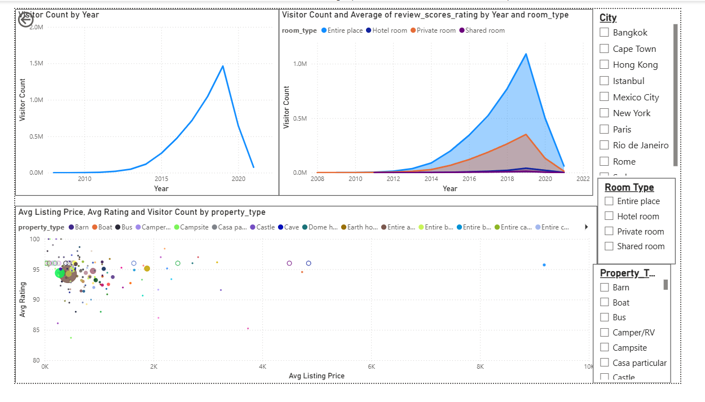
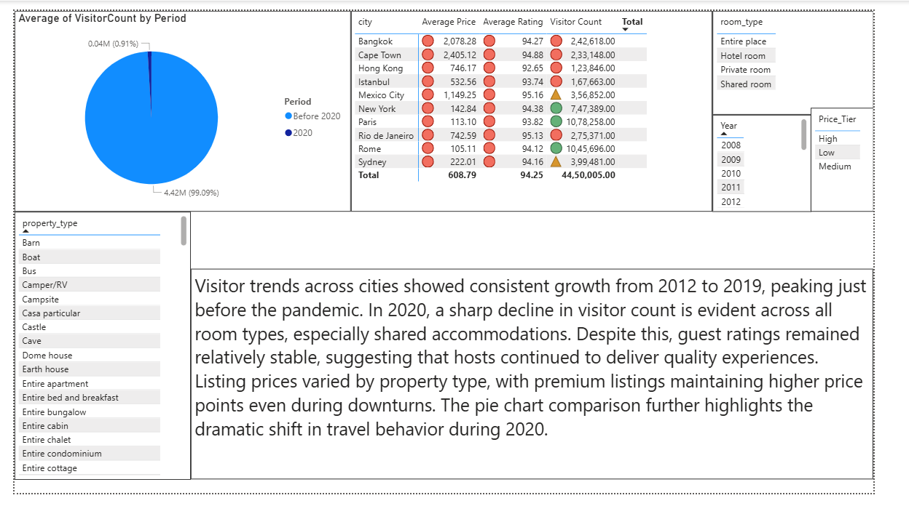

# AIRBNB Power BI Analysis

- ⚠️ **Deployment Note:** Due to licensing restrictions with the Power BI Service cloud deployment (requiring an organizational/corporate account), the interactive web-link feature is temporarily unavailable. 
- To review this project, please browse the **comprehensive dashboard screenshots** documented below, or download the source `.pbix` file to open directly in **Power BI Desktop**.
- Link for downloading the Power BI File: https://drive.google.com/file/d/1D9rdh3urFxwyQQIvqeDn0s1fttW0NcBU/view?usp=sharing

##### Chart1

##### Chart2

##### Chart3

##### Chart4

##### Chart5

##### Chart6

##### Chart7

##### Chart8

##### Chart9
